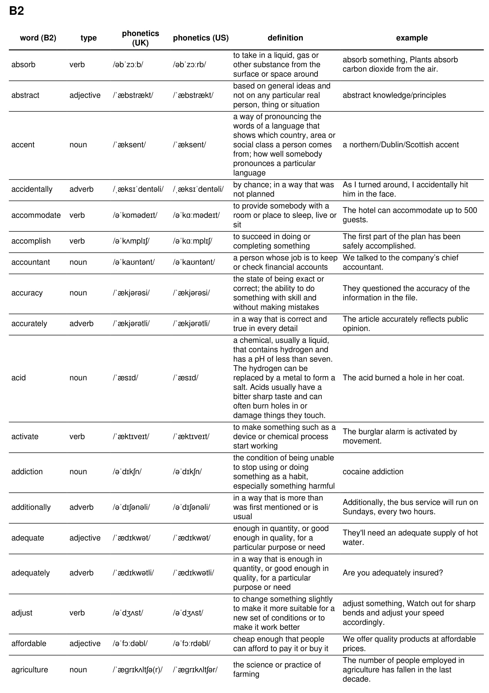
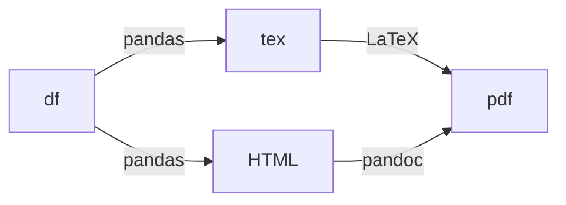

# English vocabulary + pronunciation + definition

This project aims to provide easy-to-read and printable vocabulary list of the
most common words of the English language with their meaning.

The lists are mostly based on data gathered from the oxford 3000, 5000 and 5000 exclusive lists.

The word lists contain the following points of data
* Spelling (text)
* Pronunciation (audio)
* Lexical spelling (text)
* Meaning (text)
* Example (text)

This project contains scripts to extract data and formatting. 

## Requirements
see `scraping` below
see `formatting` below

## Data
Extracted data is hosted seperately on mediafire and can be
found in formats `.pkl`, `.csv`, `.json`
Audio consists of around 10,000 *.mp3 files totalling 200MB

Formatted lists in `/output` are formatted alphabetically, by CEFR rating, random and viewable in
`.pdf` and `.html` format.

## Sample outputs

1. grouped by CEFR alphabetical order 

[by_cefr_pdf_sample](./img/oxford_5000_exclusive_by_cefr_sample.pdf)

2. grouped by CEFR two columns word/type/definition

[by_cefr_two_column_by_cefr_shuffle_pdf_sample](./img/oxford_5000_exclusive_two_column_by_cefr_shuffle_sample.pdf)

## Folder structure
```
├── audio
│   ├── *_uk.mp3
│   ├── *_us.mp3
│   ├── ...
├── data
│   ├── df_concat.pkl
│   ├── df_definition.pkl
│   ├── df.pkl
│   ├── oxford_3000.csv
│   ├── oxford_3000.json
│   ├── oxford_3000.pkl
│   ├── oxford_5000.csv
│   ├── oxford_5000_exclusive.csv
│   ├── oxford_5000_exclusive.json
│   ├── oxford_5000_exclusive.pkl
│   ├── oxford_5000.json
│   └── oxford_5000.pkl
├── output
│   ├── oxford_3000_alphabetical.html
│   ├── oxford_3000_alphabetical.pdf
│   ├── oxford_3000_by_cefr.html
│   ├── oxford_3000_by_cefr.pdf
│   ├── oxford_3000_two_column_alphabetical.pdf
│   ├── oxford_3000_two_column_by_cefr.pdf
│   ├── oxford_5000_alphabetical.html
│   ├── oxford_5000_alphabetical.pdf
│   ├── oxford_5000_by_cefr.html
│   ├── oxford_5000_by_cefr.pdf
│   ├── oxford_5000_exclusive_alphabetical.html
│   ├── oxford_5000_exclusive_alphabetical.pdf
│   ├── oxford_5000_exclusive_by_cefr.html
│   ├── oxford_5000_exclusive_by_cefr.pdf
│   ├── oxford_5000_exclusive_two_column_alphabetical.pdf
│   ├── oxford_5000_exclusive_two_column_by_cefr.pdf
│   ├── oxford_5000_two_column_alphabetical.pdf
│   └── oxford_5000_two_column_by_cefr.pdf
├── format.ipynb
└── scrape.ipynb

```
## Scraping
Selenium, beautifulsoup4, requests, pandas
and geckodriver

https://github.com/mozilla/geckodriver/releases
```
$ tar -xf geckodriver-v0.30.0-linux64.tar.gz
$ chmod +x geckodriver
$ mv geckodriver /usr/local/bin

```
See `scrape.ipynb`

## Formatting
pip:
* jinja2
* pandas

ubuntu packages:
* pandoc
* texlive
* texlive-fonts-extra
* latexmk
* [hwkhtmltopdf](ttps://wkhtmltopdf.org/downloads.html)


Complicated phonetic pronunciation (e.g. `/ˈeɪbl/`) won't work well. So instead we convert to HTML


See `format.ipynb`

## Resources and credit
Oxford 5000 list, online interface to lookup words, filter by CEFR level,
listen pronunciation (US,UK)
also shows meaning but only after clicking to a new page.
https://www.oxfordlearnersdictionaries.com/wordlists/oxford3000-5000

dictionary by tusharlock10
https://github.com/tusharlock10/Dictionary
with relevant stackoverflow thread
https://stackoverflow.com/questions/41768215/english-json-dictionary-with-word-word-type-and-definition
