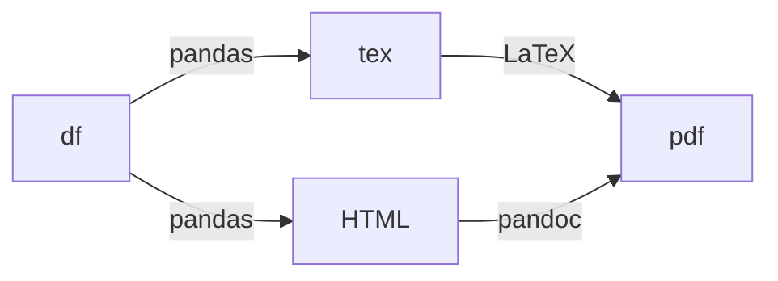

# Spanish vocabulary + definition + examples translation

```
latexmk -pdfxe -cd format/spanish_5000_two_column_alphabetical_by_rank_with_example.tex -outdir=../output
```


This project aims to provide easy-to-read and printable vocabulary list of the
most common words of the English language with their meaning.

The lists are mostly based on data gathered from the oxford 3000, 5000 and 5000 exclusive lists.

The word lists contain the following points of data
* Spelling (text)
* Lexical spelling (text)
* Meaning (text)
* Example (text)
* Example translation (text)

This project contains scripts to extract data and formatting. 

## Requirements
see `scraping` below
see `formatting` below

## Data


## Sample outputs

To be updated 

1. grouped by CEFR alphabetical order 

[by_cefr_pdf_sample](./img/oxford_5000_exclusive_by_cefr_sample.pdf)

2. grouped by CEFR two columns word/type/definition

[by_cefr_two_column_by_cefr_shuffle_pdf_sample](./img/oxford_5000_exclusive_two_column_by_cefr_shuffle_sample.pdf)

## Folder structure
```
├── data
│   ├── df.pkl
├── output
│   └── *pdf / *html
├── format.ipynb
└── scrape.ipynb

```
## Scraping
beautifulsoup4, requests, pandas


```
See `scrape.ipynb`

## Formatting
pip:
* jinja2
* pandas

ubuntu packages:
* pandoc
* texlive
* texlive-fonts-extra
* latexmk
* [hwkhtmltopdf](ttps://wkhtmltopdf.org/downloads.html)


Complicated phonetic pronunciation (e.g. `/ˈeɪbl/`) won't work well. So instead we convert to HTML


See `format.ipynb`

## Resources and credit
